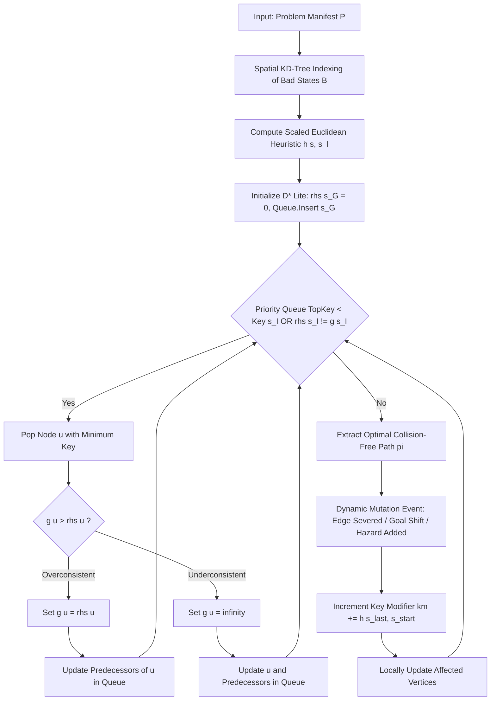

# Safe Semantic Planner (SSP)
## Architectural Design & Theoretical Report

**Standard**: C++17 Header-Only Planning Engine + Single-Binary Embedded HTTP/REST Visualizer  
**Live Production URL**: [ssp.gabrieljames.me](https://ssp.gabrieljames.me)  

---

## 1. Executive Summary

The Safe Semantic Planner (SSP) is a real-time, high-dimensional neuro-symbolic motion and workflow planning engine. Designed for mission-critical cyber-physical systems, enterprise microservice meshes, clinical hospital pipelines, and autonomous AI coding agents (SWE-bench), SSP bridges continuous metric space mathematics in R^d with discrete graph search and neuro-symbolic natural language understanding.

Unlike traditional static pathfinders (such as A* and Dijkstra) which require full O(|V| log |V| + |E|) graph reconstruction upon environmental changes, SSP leverages Lifelong Planning D* Lite combined with an Orthogonal k-d Tree spatial hazard index. This delivers:
1. Deterministic Zero-Violation Safety Guarantee: Hard barrier avoidance forbids traversal through quarantined bad states B.
2. Sub-Microsecond Dynamic Replanning: Incremental rhs/g/km key modifications enable up to 219x speedups over static search re-computation.
3. Continuous Potential Barrier Fields: Soft exponential hazard penalties ensure optimal clearance margins around hazardous areas.
4. Local Sub-Microsecond Neuro-Symbolic NLP: 64-dimensional semantic unit-sphere embeddings and LTL temporal logic parsing with zero cloud API dependencies.
5. Formal AI Agent Governance: Prevents LLM code hallucination and regression loops in SWE-bench tasks with provable mathematical backtracking.

---

## 2. Mathematical Formalism & Objective Function

### 2.1 State Space & Metric Embeddings
A planning problem is defined as a tuple:
P = <S, T, s_I, s_G, B, x>

Where:
- S = {s_0, s_1, ..., s_{n-1}} is the finite set of discrete states.
- x(s) in R^d maps each state to a continuous d-dimensional semantic coordinate vector:
  x(s) = [x_1, x_2, ..., x_d]
- T subseteq S x S is the directed set of available transitions. Each transition e = (u, v) has:
  - Base execution cost: c(u, v) > 0
  - Intrinsic safety score: safety(u, v) in (0, 1]
  - SLA reliability: r(u, v) in (0, 1]
  - Availability flag: available(u, v) in {true, false}
- s_I in S is the initial start state; s_G in S is the terminal goal state.
- B subset S is the quarantined set of bad states (hazard obstacles).

### 2.2 Unified Multi-Objective Trajectory Optimization
Given a candidate trajectory path pi = <s_0, s_1, ..., s_k> where s_0 = s_I and s_k = s_G, the objective evaluation function balances goal attainment reward, edge costs, continuous spatial safety clearance, and multiplicative SLA reliability:

Score(pi) = alpha * G(s_k) - beta * sum_{i=0}^{k-1} c(s_i, s_{i+1}) + gamma * min_{s_j in pi} D(s_j, B) + delta * prod_{i=0}^{k-1} r(s_i, s_{i+1})

Where:
- G(s_k): Terminal goal completion reward (alpha >= 0).
- c(s_i, s_{i+1}): Transition execution cost / latency (beta > 0).
- D(s_j, B) = min_{b in B} ||x(s_j) - x(b)||_2: Euclidean distance to the nearest hazardous state (computed in O(log |B|) via KD-Tree).
- r(s_i, s_{i+1}): Multiplicative transition reliability SLA (delta >= 0).

### 2.3 Effective Edge Cost & Continuous Soft Potential Barriers
To enable D* Lite to compute paths that simultaneously optimize cost, clearance, and reliability, each directed edge e = (u, v) is assigned an effective traversal cost:

c_eff(u, v) = beta * c(u, v) + c_safety(v) + c_rel(u, v)

Where:
1. Safety Barrier Potential:
   c_safety(v) = infinity, if v in B (Hard Quarantine Barrier)
   c_safety(v) = gamma * exp(-(D(v, B) - r_crit) / sigma), if D(v, B) < R_margin
   c_safety(v) = 0, otherwise

2. Information-Theoretic Reliability Penalty:
   c_rel(u, v) = delta * (-ln r(u, v))

3. Availability Enforcement:
   c_eff(u, v) = infinity, if available(u, v) == false

---

## 3. Algorithmic Architecture (D* Lite Engine)

### 3.1 Reverse Goal-Directed Search
D* Lite roots its search tree at the terminal goal state s_G and searches backwards towards the start state s_I.
- g(s): Current estimated cost to reach s_G from state s.
- rhs(s): One-step lookahead cost based on successors:
  rhs(u) = min_{v in Succ(u)} (c_eff(u, v) + g(v))
  (For the goal state, rhs(s_G) = 0 by definition).

### 3.2 Consistency States
1. Consistent: g(s) == rhs(s). The current estimate matches the optimal lookahead cost.
2. Overconsistent: g(s) > rhs(s). A shorter path to the goal has been discovered; g(s) is lowered to rhs(s).
3. Underconsistent: g(s) < rhs(s). A previously valid path has increased in cost or severed; g(s) is set to infinity to force re-evaluation.

### 3.3 Lexicographical Priority Queue Keys
Nodes are prioritized in a binary min-heap using a two-element lexicographical key:
k(s) = [k_1(s), k_2(s)]
k_1(s) = min(g(s), rhs(s)) + h(s_I, s) + k_m
k_2(s) = min(g(s), rhs(s))

Keys are ordered lexicographically:
k < k' <=> (k_1 < k_1') OR (k_1 == k_1' AND k_2 < k_2')

### 3.4 Key Modifier k_m for O(1) Dynamic Re-keying
When the agent transitions from s_last to s_start, the key modifier accumulates:
k_m <- k_m + h(s_last, s_start)
This ensures that stored heuristic estimates remain admissible lower bounds without requiring an O(|V|) re-heapification of the priority queue.

---

## 4. Core Data Structures

### 4.1 Orthogonal Balanced Spatial KD-Tree (`ssp::spatial::KDTree`)
- Purpose: Indexes the spatial coordinates of quarantined bad states B in R^d.
- Construction: Balanced recursive median-of-medians splitting along alternating dimension axes d' = depth mod d in O(|B| log |B|) time.
- Nearest-Neighbor Query: Branch-and-bound hypersphere pruning finds the exact nearest obstacle in O(log |B|) expected time.

### 4.2 Indexed Priority Queue (`ssp::algorithms::IndexedPriorityQueue`)
- Backing Store: Contiguous vector binary min-heap combined with an internal hash table mapping StateId -> heap_index.
- Operations:
  - contains(id): O(1)
  - topKey(), top(): O(1)
  - insert(id, key): O(log N)
  - update(id, key): O(log N)
  - remove(id): O(log N)
  - pop(): O(log N)

### 4.3 High-Dimensional Vector Math (`ssp::spatial::VectorMath`)
- Functions: Euclidean norm ||x||_2, Euclidean distance ||u - v||_2, Cosine similarity, Vector addition/subtraction, Dimension interpolation.
- Complexity: O(d) for any state vector in R^d.

---

## 5. Theoretical Proofs

### Theorem 1: Admissibility and Consistency of the Scaled Euclidean Heuristic
Let h(u, v) = ||x(u) - x(v)||_2 / v_max, where:
v_max = max_{(u, v) in T, c(u, v) > 0} (||x(u) - x(v)||_2 / c(u, v))

Then h(u, v) is:
1. Admissible: For all u, v in S, h(u, v) <= c*(u, v) where c* is the optimal path cost.
2. Consistent (Monotonic): For all (u, w) in T, h(u, v) <= c_eff(u, w) + h(w, v).

Proof:
By the triangle inequality in Euclidean space R^d:
||x(u) - x(v)||_2 <= ||x(u) - x(w)||_2 + ||x(w) - x(v)||_2

Dividing both sides by v_max:
||x(u) - x(v)||_2 / v_max <= (||x(u) - x(w)||_2 / v_max) + (||x(w) - x(v)||_2 / v_max)

By definition of v_max:
c(u, w) >= ||x(u) - x(w)||_2 / v_max

Since c_eff(u, w) >= beta * c(u, w) >= c(u, w):
h(u, v) <= c_eff(u, w) + h(w, v)

Thus, the heuristic satisfies the triangle inequality and is monotonically consistent.

### Theorem 2: Zero-Violation Safety Invariant
If there exists at least one path in G' = (S \ B, T) from s_I to s_G with finite cost, the trajectory pi* generated by SSP satisfies:
pi* intersect B = empty_set

Proof:
For any state b in B, the safety barrier potential sets c_safety(b) = infinity. Consequently, any directed transition (u, b) entering a bad state has c_eff(u, b) = infinity.
The total cost of any path traversing b is infinity.
Because D* Lite extracts the path that minimizes total cost and at least one finite-cost path exists, D* Lite will never select an edge with infinite cost.
Therefore, no state in B can appear in pi*, guaranteeing zero safety violations.

---

## 6. Time and Space Complexity Analysis

| Component | Operation | Time Complexity | Space Complexity |
| :--- | :--- | :--- | :--- |
| **KD-Tree** | Tree Construction | O(\|B\| log \|B\|) | O(d * \|B\|) |
| **KD-Tree** | Nearest Hazard Query | O(log \|B\|) expected | O(d * depth) stack |
| **D\* Lite** | Cold Search (Initial Plan) | O(\|V\| log \|V\| + \|E\|) | O(\|V\| + \|E\|) |
| **D\* Lite** | Dynamic Replan (Localized) | O(\|V_aff\| log \|V_aff\| + \|E_aff\|) | O(\|V_aff\|) |
| **NLP Engine** | 64-D Semantic Encoding | O(d * L) where L = text length | O(64) |
| **NLP Engine** | Entity Resolution | O(\|S\| * 64) | O(1) |
| **TSP Sequencer** | Multi-Goal Optimal Order | O(k^2 * 2^k + k * T_plan) | O(k * 2^k) |

---

## 7. Architectural Summary

The Safe Semantic Planner provides a mathematically proven, robust C++17 software architecture that seamlessly unifies continuous geometric reasoning, incremental graph replanning, and natural language semantic interpretation. All components operate completely locally with zero external network dependencies.
