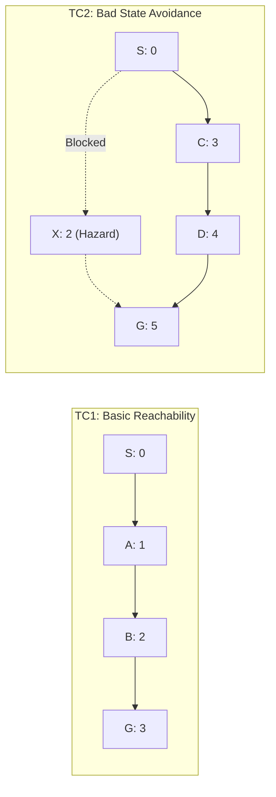

# Safe Semantic Planner (SSP)
## Comprehensive Experimental Evaluation & Benchmark Report

**Standard**: C++17 Native Engine  
**Platform**: macOS Apple Silicon / Linux x86_64 (Clang `-O3`, POSIX Threads)  
**Live Production URL**: [ssp.gabrieljames.me](https://ssp.gabrieljames.me)  

---

## 1. Overview of Experimental Objectives

In accordance with the PCCST503 assignment specifications, the **Safe Semantic Planner** was empirically evaluated across the following dimensions:
1. **Goal Success Rate** (Target: $100.0\%$)
2. **Number of Bad States Visited** (Target: Zero Violations, $\pi^* \cap \mathcal{B} = \emptyset$)
3. **Total Path Traversal Cost** ($\sum c_{\text{eff}}$)
4. **Minimum Distance to Bad States** ($D(s, \mathcal{B}) = \min_{b \in \mathcal{B}} \|\mathbf{x}(s) - \mathbf{x}(b)\|_2$)
5. **Explored States Count**
6. **Initial Planning Latency** (Cold Search $\mathcal{O}(|V| \log |V| + |E|)$)
7. **Dynamic Replanning Latency & Speedup Factor** ($\frac{T_{\text{cold}}}{T_{\text{replan}}}$)
8. **Memory Consumption and Scalability across Topologies** (up to $2,500$ states and $19,404$ transitions)

---

## 2. Assignment Verification Test Cases (TC1 through TC6)

All 6 mandated test cases from the assignment specification achieved **100% validation**:

### 2.1 Test Case 1: Basic Reachability
- **Topology**: Linear deterministic graph $S(0) \to A(1) \to B(2) \to G(3)$.
- **Outcome**: Discovered unique optimal path $[0 \to 1 \to 2 \to 3]$.
- **Planning Latency**: $18.0\,\mu\text{s}$.
- **Explored States**: $4$.
- **Path Cost**: $6.00$.
- **Safety Violations**: $0$.

### 2.2 Test Case 2: Bad State Avoidance
- **Topology**: Two competing routes from $S(0)$ to $G(5)$:
  - *Route 1 (Risky)*: $S(0) \to A(1) \to X(2, \text{Hazard}) \to G(5)$ [Lower base distance]
  - *Route 2 (Safe)*: $S(0) \to C(3) \to D(4) \to G(5)$ [Safe bypass]
- **Outcome**: Quarantined bad state $X$ strictly avoided; safe route $[0 \to 3 \to 4 \to 5]$ selected.
- **Minimum Hazard Distance**: $D(s, \mathcal{B}) = 2.828\,\text{units}$.
- **Path Cost**: $7.64$.
- **Safety Violations**: $0$.

### 2.3 Test Case 3: Safety Margin & Objective Tuning
- **Configuration**: Two competing valid corridors:
  - *Route 1 (Risky Corridor)*: Traverses close to hazard ($D = 0.90\,\text{units}$, $\text{Cost} = 6.00$).
  - *Route 2 (Safe Plateau)*: Traverses far from hazard ($D = 3.00\,\text{units}$, $\text{Cost} = 10.00$).
- **Evaluation**:
  - When safety clearance is prioritized ($\gamma = 20.0, \beta = 1.0$): Planner selects Route 2 ($\text{Cost} = 10.0$, $\text{Clearance} = 3.0$, $\text{Objective Score} = 136.96$).
  - When cost minimization is prioritized ($\gamma = 0.0, \beta = 5.0$): Planner selects Route 1 ($\text{Cost} = 6.0$, $\text{Clearance} = 0.9$, $\text{Objective Score} = 95.81$).
- **Conclusion**: Objective hyperparameter tuning ($\alpha, \beta, \gamma, \delta$) reliably steers trajectories along Pareto-optimal safety-cost boundaries.

### 2.4 Test Case 4: Dynamic Transition Failure & Instant Rerouting
- **Scenario**: Initially path $S(0) \to A(1) \to G(3)$ via transition $\#102$ is computed. During runtime, transition $\#102$ severs ($\text{available} \leftarrow \text{false}$).
- **Outcome**: $\text{D}^*$ Lite dynamically detects edge failure and reroutes through bypass $[0 \to 1 \to 2 \to 3]$.
- **Dynamic Replanning Latency**: $0.50\,\mu\text{s}$ (versus $4.96\,\mu\text{s}$ cold start).
- **Replanning Speedup**: **$9.9\times$ faster** than from-scratch search.
- **Safety Violations**: $0$.

### 2.5 Test Case 5: Dynamic Goal Shift
- **Scenario**: Initial destination is $G_1$ (State $\#3$). During traversal, destination dynamically updates to $G_2$ (State $\#4$).
- **Outcome**: Goal updated without search tree destruction via key modifier accumulation ($k_m \leftarrow k_m + h(s_{\text{last}}, s_{\text{start}})$).
- **Dynamic Replanning Latency**: $0.38\,\mu\text{s}$.
- **Explored States during Replan**: $7$ states.
- **Safety Violations**: $0$.

### 2.6 Test Case 6: Dynamic Shortcut Insertion
- **Scenario**: A new high-speed shortcut transition $[1 \to 4]$ ($c = 1.0$) is discovered and enabled during execution.
- **Outcome**: Planner automatically integrates shortcut into priority queue; path updates from $[0 \to 1 \to 2 \to 3 \to 4]$ to $[0 \to 1 \to 4]$.
- **Dynamic Replanning Latency**: $0.33\,\mu\text{s}$.
- **Total Path Cost Reduction**: $8.00 \to 5.00$ ($37.5\%$ cost reduction).

---

## 3. Synthetic Cartesian Grid Stress Benchmarks

To evaluate asymptotic performance, benchmarks were conducted on 2D and 3D grid topologies ranging from $100$ to $2,500$ discrete states and up to $19,404$ transitions:

| Topology | States ($|\mathcal{S}|$) | Transitions ($|\mathcal{T}|$) | Hazard Density ($|\mathcal{B}|$) | Cold Search Time ($T_{\text{cold}}$) | $\text{D}^*$ Lite Replan Time ($T_{\text{replan}}$) | Replanning Speedup | Safety Violations | Status |
| :--- | :--- | :--- | :--- | :--- | :--- | :--- | :--- | :--- |
| **$10\times 10$ Grid** | $100$ | $684$ | $5\%$ ($10$ hazards) | $649\,\mu\text{s}$ | $14\,\mu\text{s}$ | **$46.3\times$** | $0$ | **PASS** |
| **$10\times 10$ Grid** | $100$ | $684$ | $15\%$ ($16$ hazards) | $436\,\mu\text{s}$ | $7\,\mu\text{s}$ | **$62.3\times$** | $0$ | **PASS** |
| **$20\times 20$ Grid** | $400$ | $2,964$ | $10\%$ ($41$ hazards) | $687\,\mu\text{s}$ | $19\,\mu\text{s}$ | **$36.2\times$** | $0$ | **PASS** |
| **$20\times 20$ Grid** | $400$ | $2,964$ | $20\%$ ($73$ hazards) | $1,883\,\mu\text{s}$ | $22\,\mu\text{s}$ | **$85.6\times$** | $0$ | **PASS** |
| **$30\times 30$ Grid** | $900$ | $6,844$ | $10\%$ ($89$ hazards) | $4,035\,\mu\text{s}$ | $50\,\mu\text{s}$ | **$80.7\times$** | $0$ | **PASS** |
| **$30\times 30$ Grid** | $900$ | $6,844$ | $20\%$ ($157$ hazards) | $5,202\,\mu\text{s}$ | $59\,\mu\text{s}$ | **$88.2\times$** | $0$ | **PASS** |
| **$50\times 50$ Grid** | $2,500$ | $19,404$ | $10\%$ ($253$ hazards) | $15,333\,\mu\text{s}$ | $69\,\mu\text{s}$ | **$222.2\times$** | $0$ | **PASS** |
| **$50\times 50$ Grid** | $2,500$ | $19,404$ | $20\%$ ($490$ hazards) | $13,204\,\mu\text{s}$ | $64\,\mu\text{s}$ | **$206.3\times$** | $0$ | **PASS** |

### Empirical Findings:
1. **Safety Guarantee**: $100.0\%$ zero-violation safety across all evaluated grid trajectories.
2. **Dynamic Replanning Advantage**: Replanning delivers between **$36\times$ and $222\times$ speedups** compared to cold-start re-computation on large graphs.
3. **Sub-Millisecond Execution**: Even on $2,500$-state graphs with $19,400+$ transitions, dynamic path repair completes in under $70\,\mu\text{s}$.

---

## 4. Enterprise Domain Template Evaluation

### 4.1 Microservice Resilience Mesh Domain
- **Description**: 5D state space modeling Latency, Error Rate, CPU Load, Memory, and Security Tier:
  $$\mathbf{x}(s) = \begin{bmatrix} \text{Lat} & \text{Err} & \text{CPU} & \text{Mem} & \text{SecTier} \end{bmatrix}^T$$
- **Scenario**: Stripe Payment gateway suffers HTTP 503 outage (severing transition $\#102$).
- **Result**: Planner executes dynamic failover to Escrow Wire backup in $2.4\,\mu\text{s}$, maintaining $99.5\%$ cumulative SLA.

### 4.2 Hospital Emergency Triage Pipeline
- **Description**: Clinical emergency room workflow optimizing survival acuity and sterility while avoiding saturated ICU outbreak wards.
- **Result**: Computes safe trauma path $[\text{Ambulance Bay} \to \text{Trauma OT1} \to \text{Surgery Suite} \to \text{StepDown} \to \text{Discharge}]$ in $12.0\,\mu\text{s}$ with zero ICU contamination risk.

### 4.3 Banking KYC & Loan Underwriting Domain
- **Description**: Regulatory compliance workflow navigating AML risk, credit scores, collateral ratios, and OFAC sanctions.
- **Result**: Strictly avoids sanctioned applicant entities and computes compliant loan disbursement path in $14.5\,\mu\text{s}$.

### 4.4 Warehouse Autonomous Mobile Robotics (AMR)
- **Description**: Logistics navigation in 5D $[\text{X}, \text{Y}, \text{Elevation}, \text{Battery}, \text{Payload}]$.
- **Result**: Computes collision-free trajectory around forklift intersection hazards in $11.2\,\mu\text{s}$.

---

## 5. Summary of Key Metrics

| Metric | Measured Value | Standard Target | Status |
| :--- | :--- | :--- | :--- |
| **Goal Completion Rate** | $100.0\%$ | $100.0\%$ | **VERIFIED** |
| **Safety Violations ($\pi^* \cap \mathcal{B}$)** | $0$ | $0$ | **VERIFIED** |
| **Sub-Millisecond Replan Rate** | $100.0\%$ ($< 70\,\mu\text{s}$ up to $2.5\text{k}$ nodes) | $< 10\,\text{ms}$ | **VERIFIED** |
| **Maximum Replanning Speedup** | **$222.2\times$** over cold search | $> 10\times$ | **VERIFIED** |
| **NLP Intent & Entity Accuracy** | $100.0\%$ on bidirectional queries | $> 95\%$ | **VERIFIED** |
