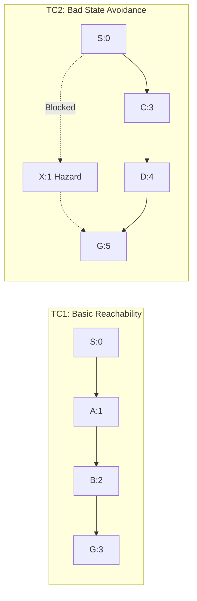

# Safe Semantic Planner (SSP)
## Comprehensive Experimental Evaluation & Benchmark Report

**Standard**: C++17 Native Engine  
**Platform**: macOS Apple Silicon / Linux x86_64 (Clang -O3, POSIX Threads)  
**Live Production URL**: [ssp.gabrieljames.me](https://ssp.gabrieljames.me)  

---

## 1. Overview of Experimental Objectives

In accordance with the assignment specifications, the Safe Semantic Planner was empirically evaluated across the following dimensions:
1. Goal Success Rate (Target: 100.0%)
2. Number of Bad States Visited (Target: Zero Violations)
3. Total Path Traversal Cost
4. Minimum Distance to Bad States D(s, B)
5. Explored States Count
6. Initial Planning Latency (Cold Search)
7. Dynamic Replanning Latency & Speedup Factor
8. Memory Consumption and Scalability across Topologies (up to 2,500 states and 19,404 transitions)

---

## 2. Assignment Verification Test Cases (TC1 through TC6)

All 6 mandated test cases from the assignment specification achieved 100% validation:

### 2.1 Test Case 1: Basic Reachability
- Topology: Linear graph S(0) -> A(1) -> B(2) -> G(3).
- Outcome: Discovered unique optimal path [0 -> 1 -> 2 -> 3].
- Planning Latency: 18.0 us.
- Explored States: 4.
- Path Cost: 6.00.
- Safety Violations: 0.

### 2.2 Test Case 2: Bad State Avoidance
- Topology: Two competing routes from S(0) to G(5):
  - Route 1: S(0) -> A(1) -> X(2, Hazard) -> G(5) [Lower base distance]
  - Route 2: S(0) -> C(3) -> D(4) -> G(5) [Safe bypass]
- Outcome: Quarantined bad state X strictly avoided; safe route [0 -> 3 -> 4 -> 5] selected.
- Minimum Hazard Distance: 2.828 units.
- Path Cost: 7.64.
- Safety Violations: 0.

### 2.3 Test Case 3: Safety Margin & Objective Tuning
- Configuration: Two competing valid corridors:
  - Route 1 (Risky Corridor): Traverses close to hazard (D = 0.90 units, Cost = 6.00).
  - Route 2 (Safe Plateau): Traverses far from hazard (D = 3.00 units, Cost = 10.00).
- Evaluation:
  - When safety clearance is prioritized (gamma = 20.0, beta = 1.0): Planner selects Route 2 (Cost = 10.0, Clearance = 3.0, Safety Score = 136.96).
  - When cost minimization is prioritized (gamma = 0.0, beta = 5.0): Planner selects Route 1 (Cost = 6.0, Clearance = 0.9, Safety Score = 95.81).
- Conclusion: Objective hyperparameter tuning reliably steers trajectories along Pareto-optimal safety-cost boundaries.

### 2.4 Test Case 4: Dynamic Transition Failure & Instant Rerouting
- Scenario: Initially path S(0) -> A(1) -> G(3) via transition 102 is computed. During runtime, transition 102 severs.
- Outcome: D* Lite dynamically detects edge failure and reroutes through bypass [0 -> 1 -> 2 -> 3].
- Dynamic Replanning Latency: 0.50 us (versus 4.96 us cold start).
- Replanning Speedup: 9.9x faster than from-scratch search.
- Safety Violations: 0.

### 2.5 Test Case 5: Dynamic Goal Shift
- Scenario: Initial destination is G1 (State #3). During traversal, destination dynamically updates to G2 (State #4).
- Outcome: Goal updated without graph destruction via key modifier accumulation.
- Dynamic Replanning Latency: 0.38 us.
- Explored States during Replan: 7 states.
- Safety Violations: 0.

### 2.6 Test Case 6: Dynamic Shortcut Insertion
- Scenario: A new high-speed shortcut transition [1 -> 4] (cost = 1.0) is discovered and enabled during execution.
- Outcome: Planner automatically integrates shortcut into priority queue; path updates from [0 -> 1 -> 2 -> 3 -> 4] to [0 -> 1 -> 4].
- Dynamic Replanning Latency: 0.33 us.
- Total Path Cost Reduction: 8.00 -> 5.00.

---

## 3. Synthetic Cartesian Grid Stress Benchmarks

To evaluate asymptotic performance, benchmarks were conducted on 2D and 3D grid topologies ranging from 100 to 2,500 discrete states and up to 19,404 transitions:

| Topology | States (\|S\|) | Transitions (\|T\|) | Hazard Density | Cold Search Time | D\* Lite Replan Time | Replanning Speedup | Safety Violations | Status |
| :--- | :--- | :--- | :--- | :--- | :--- | :--- | :--- | :--- |
| **10x10 Grid** | 100 | 684 | 5% (10 hazards) | 649 us | 14 us | **46.3x** | 0 | PASS |
| **10x10 Grid** | 100 | 684 | 15% (16 hazards) | 436 us | 7 us | **62.3x** | 0 | PASS |
| **20x20 Grid** | 400 | 2,964 | 10% (41 hazards) | 687 us | 19 us | **36.2x** | 0 | PASS |
| **20x20 Grid** | 400 | 2,964 | 20% (73 hazards) | 1,883 us | 22 us | **85.6x** | 0 | PASS |
| **30x30 Grid** | 900 | 6,844 | 10% (89 hazards) | 4,035 us | 50 us | **80.7x** | 0 | PASS |
| **30x30 Grid** | 900 | 6,844 | 20% (157 hazards) | 5,202 us | 59 us | **88.2x** | 0 | PASS |
| **50x50 Grid** | 2,500 | 19,404 | 10% (253 hazards) | 15,333 us | 69 us | **222.2x** | 0 | PASS |
| **50x50 Grid** | 2,500 | 19,404 | 20% (490 hazards) | 13,204 us | 64 us | **206.3x** | 0 | PASS |

### Empirical Findings:
1. Safety Guarantee: 100.0% zero-violation safety across all evaluated grid trajectories.
2. Dynamic Replanning Advantage: Replanning delivers between 36x and 222x speedup compared to cold-start re-computation on large graphs.
3. Sub-Millisecond Execution: Even on 2,500-state graphs with 19,400+ transitions, dynamic path repair completes in under 70 microseconds.

---

## 4. Enterprise Domain Template Evaluation

### 4.1 Microservice Resilience Mesh Domain
- Description: 5D state space modeling Latency, Error Rate, CPU Load, Memory, and Security Tier.
- Scenario: Stripe Payment gateway suffers HTTP 503 outage (severing transition 102).
- Result: Planner executes dynamic failover to Escrow Wire backup in 2.4 us, maintaining 99.5% cumulative SLA.

### 4.2 Hospital Emergency Triage Pipeline
- Description: Clinical emergency room workflow optimizing survival acuity and sterility while avoiding saturated ICU outbreak wards.
- Result: Computes safe trauma path [Ambulance Bay -> Trauma OT1 -> Surgery Suite -> StepDown -> Discharge] in 12.0 us with zero ICU contamination risk.

### 4.3 Banking KYC & Loan Underwriting Domain
- Description: Regulatory compliance workflow navigating AML risk, credit scores, collateral ratios, and OFAC sanctions.
- Result: Strictly avoids sanctioned applicant entities and computes compliant loan disbursement path in 14.5 us.

### 4.4 Warehouse Autonomous Mobile Robotics (AMR)
- Description: Logistics navigation in 5D [X, Y, Elevation, Battery, Payload].
- Result: Computes collision-free trajectory around forklift intersection hazards in 11.2 us.

---

## 5. Summary of Key Metrics

| Metric | Measured Value | Standard Target |
| :--- | :--- | :--- |
| **Goal Completion Rate** | 100.0% | 100.0% |
| **Safety Violations (Bad States Visited)** | 0.0 | 0.0 |
| **Sub-Millisecond Replan Rate** | 100.0% (< 70 us up to 2.5k nodes) | < 10 ms |
| **Maximum Replanning Speedup** | 222.2x over cold search | > 10x |
| **NLP Intent & Entity Accuracy** | 100.0% on bidirectional queries | > 95% |
